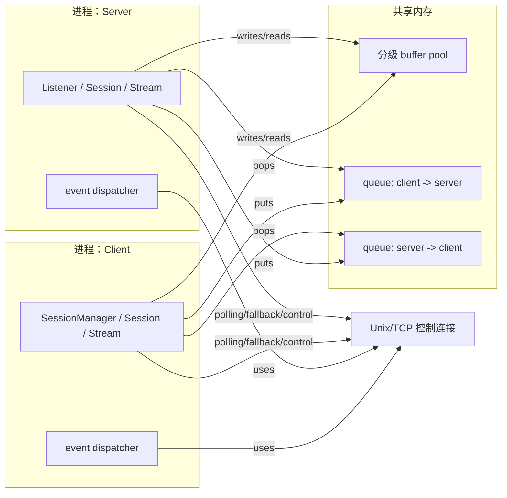
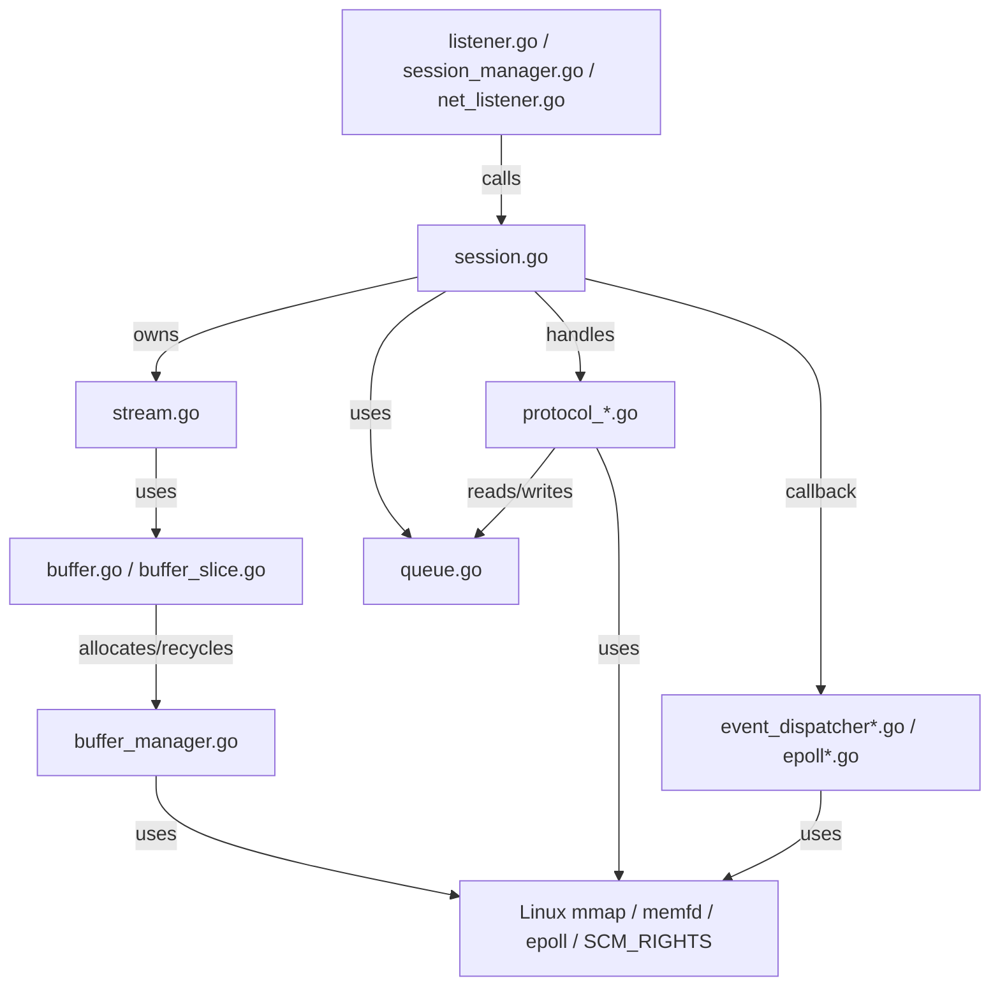
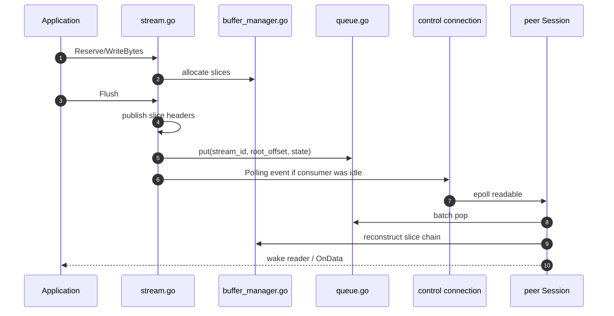
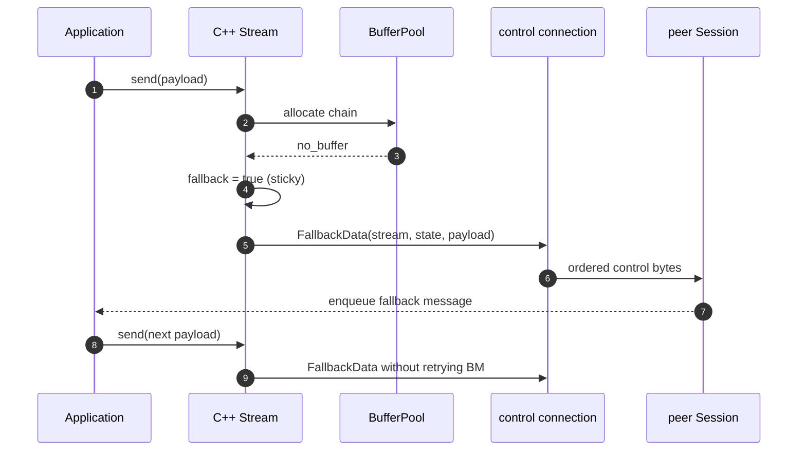
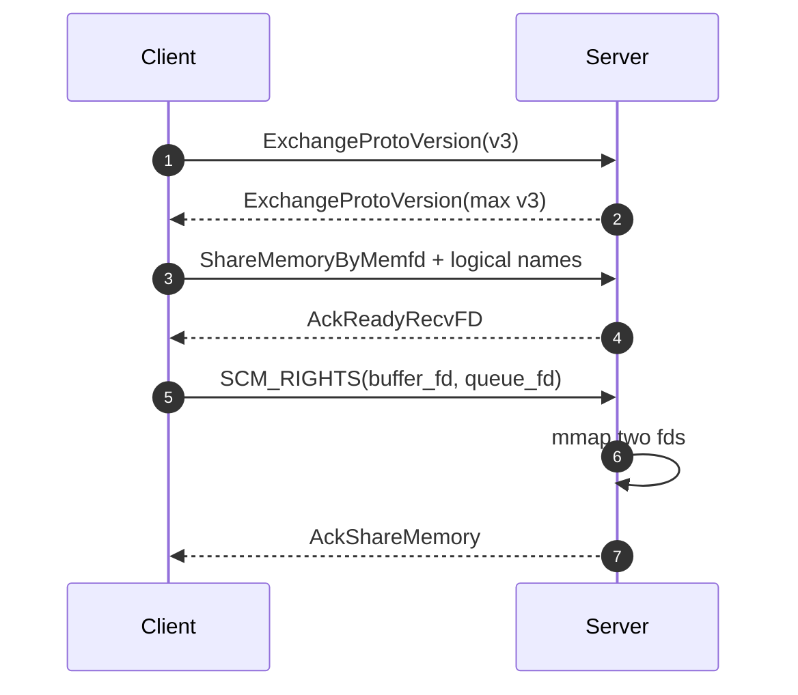

# 架构关系图

## 当前 C++ 依赖与协议验证

```mermaid
graph TD
  consumer["consumer / examples / public tests"]
  public["include/shmipc/version.hpp + session.hpp"]
  public_impl["src/session.cpp PImpl adapter"]
  callback_impl["src/callback.cpp async adapter"]
  stream_impl["src/public/session_impl.hpp shared PImpl"]
  callback_executor["CallbackExecutor shared thread pool"]
  library["shmipc library"]
  implementation["src/version.cpp"]
  package["shmipcConfig.cmake / shmipcTargets.cmake"]
  ci[".github/workflows/ci.yml"]
  runner["tools/go_oracle runner"]
  upstream["third_party/shmipc-go encoders"]
  golden["header / metadata / fallback fixtures"]
  codec["src/protocol/control_codec"]
  queue_layout["src/shm/queue_layout"]
  shared_queue["src/shm/shared_queue"]
  buffer_layout["src/shm/buffer_layout"]
  mapping["src/shm/shared_memory_region"]
  pool["src/shm/buffer_pool"]
  buffer_io["src/shm/buffer_io"]
  transport["src/transport/control_socket"]
  dispatcher["src/transport/epoll_dispatcher"]
  handshake["src/core/v2_handshake"]
  v3_handshake["src/core/v3_handshake"]
  client_session["src/core/v2_client_session"]
  server_session["src/core/v2_server_session"]
  multiplexed_session["src/core/v2_multiplexed_session"]
  breaker["SessionCircuitBreaker / 30s unhealthy"]
  transport_test["tests/control_socket_test.cpp"]
  dispatcher_test["tests/epoll_dispatcher_test.cpp"]
  atomic["src/shm/atomic_word"]
  interop["C++/Go buffer-chain oracle"]
  queue_interop["C++/Go queue oracle"]
  handshake_interop["C++/Go v2 handshake oracle"]
  session_interop["C++ / Go 双角色 Stream oracle"]
  multiplexed_interop["C++ / Go 多 Stream oracle"]
  golden_test["C++ codec tests"]

  consumer -- includes --> public
  consumer -- links --> library
  implementation -- implements --> public
  public_impl -- implements --> public
  public_impl -- owns --> dispatcher
  public_impl -- delegates --> multiplexed_session
  public_impl -- shares --> stream_impl
  callback_impl -- implements --> public
  callback_impl -- shares --> stream_impl
  callback_impl -- schedules --> callback_executor
  callback_impl -- drains --> multiplexed_session
  multiplexed_session -- notifies readable --> callback_impl
  library -- contains --> implementation
  library -- contains --> public_impl
  library -- contains --> callback_impl
  package -- exports --> library
  ci -- configures/builds/tests/installs --> library
  runner -- overlays/calls --> upstream
  upstream -- verifies --> golden
  codec -- encodes/decodes --> golden
  golden_test -- calls --> codec
  golden_test -- reads/verifies --> golden
  library -- contains --> codec
  library -- contains --> queue_layout
  queue_layout -- reads/writes --> golden
  shared_queue -- uses --> queue_layout
  shared_queue -- uses --> atomic
  shared_queue -- puts/pops --> queue_bytes["MPSC queue bytes / working flag"]
  library -- contains --> buffer_layout
  buffer_layout -- reads/writes --> golden
  library -- contains --> mapping
  library -- contains --> transport
  library -- contains --> dispatcher
  transport -- owns/connects/listens --> ctrl_socket["Unix/TCP socket FD"]
  dispatcher -- consumes --> transport
  dispatcher -- waits --> epoll["Linux epoll / eventfd"]
  dispatcher -- dispatches --> ctrl_callback["consuming data / close callback"]
  handshake -- exact IO --> transport
  handshake -- encodes/decodes --> codec
  handshake -- creates/maps --> mapping
  handshake -- initializes/maps --> pool
  handshake -- initializes/maps --> shared_queue
  v3_handshake -- passes/maps memfd --> mapping
  v3_handshake -- initializes/maps --> pool
  v3_handshake -- initializes/maps --> shared_queue
  client_session -- starts with --> handshake
  client_session -- registers callback --> dispatcher
  client_session -- publishes/adopts --> buffer_io
  client_session -- puts/pops --> shared_queue
  client_session -- writes polling --> transport
  server_session -- starts with --> handshake
  server_session -- shares callback state --> client_session
  server_session -- registers callback --> dispatcher
  server_session -- publishes/adopts --> buffer_io
  server_session -- puts/pops --> shared_queue
  multiplexed_session -- starts with --> handshake
  multiplexed_session -- starts with --> v3_handshake
  multiplexed_session -- routes by Stream ID --> buffer_io
  multiplexed_session -- puts/pops --> shared_queue
  multiplexed_session -- registers callback --> dispatcher
  multiplexed_session -- opens/checks --> breaker
  breaker -- rejects new streams --> multiplexed_session
  transport_test -- calls --> transport
  dispatcher_test -- calls --> dispatcher
  mapping -- owns --> os_mapping["mmap / file FD / memfd"]
  pool -- uses --> buffer_layout
  pool -- manages --> pool_bytes["tiered free lists / allocations"]
  pool -- uses --> atomic
  buffer_io -- allocates/publishes/adopts/recycles --> pool
  buffer_io -- returns --> views["borrowed single-slice / owned cross-slice views"]
  interop -- publishes/adopts --> pool
  interop -- writes/reads --> buffer_io
  interop -- calls --> upstream
  queue_interop -- puts/pops --> shared_queue
  queue_interop -- calls --> upstream
  handshake_interop -- calls --> handshake
  handshake_interop -- starts real Session --> upstream
  session_interop -- calls --> client_session
  session_interop -- calls --> server_session
  session_interop -- accepts/reads/writes/closes --> upstream
  multiplexed_interop -- calls --> multiplexed_session
  multiplexed_interop -- Open/Accept/Read/Write/Close --> upstream
  ci -- runs --> runner
```

## 运行时边界

```mermaid
graph LR
  subgraph client["进程：Client"]
    c_api["SessionManager / Session / Stream"]
    c_epoll["event dispatcher"]
  end
  subgraph shared["共享内存"]
    buf["分级 buffer pool"]
    q1["queue: client -> server"]
    q2["queue: server -> client"]
  end
  subgraph server["进程：Server"]
    s_epoll["event dispatcher"]
    s_api["Listener / Session / Stream"]
  end
  ctrl["Unix/TCP 控制连接"]

  c_api -- writes/reads --> buf
  s_api -- writes/reads --> buf
  c_api -- puts --> q1
  s_api -- pops --> q1
  s_api -- puts --> q2
  c_api -- pops --> q2
  c_epoll -- uses --> ctrl
  s_epoll -- uses --> ctrl
  c_api -- polling/fallback/control --> ctrl
  s_api -- polling/fallback/control --> ctrl
```
## 模块依赖图

```mermaid
graph TD
  api["listener.go / session_manager.go / net_listener.go"]
  session["session.go"]
  stream["stream.go"]
  buffer["buffer.go / buffer_slice.go"]
  manager["buffer_manager.go"]
  queue["queue.go"]
  protocol["protocol_*.go"]
  event["event_dispatcher*.go / epoll*.go"]
  os["Linux mmap / memfd / epoll / SCM_RIGHTS"]

  api -- calls --> session
  session -- owns --> stream
  stream -- uses --> buffer
  buffer -- allocates/recycles --> manager
  session -- uses --> queue
  session -- handles --> protocol
  protocol -- reads/writes --> queue
  session -- callback --> event
  event -- uses --> os
  manager -- uses --> os
  protocol -- uses --> os
```

## 共享内存发送链路

```mermaid
sequenceDiagram
  autonumber
  participant App as Application
  participant Stream as stream.go
  participant BM as buffer_manager.go
  participant Q as queue.go
  participant Ctrl as control connection
  participant Peer as peer Session

  App->>Stream: Reserve/WriteBytes
  Stream->>BM: allocate slices
  App->>Stream: Flush
  Stream->>Stream: publish slice headers
  Stream->>Q: put(stream_id, root_offset, state)
  Stream->>Ctrl: Polling event if consumer was idle
  Ctrl->>Peer: epoll readable
  Peer->>Q: batch pop
  Peer->>BM: reconstruct slice chain
  Peer-->>App: wake reader / OnData
```

## Sticky fallback 发送链路

```mermaid
sequenceDiagram
  autonumber
  participant App as Application
  participant Stream as C++ Stream
  participant BM as BufferPool
  participant Ctrl as control connection
  participant Peer as peer Session

  App->>Stream: send(payload)
  Stream->>BM: allocate chain
  BM-->>Stream: no_buffer
  Stream->>Stream: fallback = true (sticky)
  Stream->>Ctrl: FallbackData(stream, state, payload)
  Ctrl->>Peer: ordered control bytes
  Peer-->>App: enqueue fallback message
  App->>Stream: send(next payload)
  Stream->>Ctrl: FallbackData without retrying BM
```

## v3 memfd 握手

```mermaid
sequenceDiagram
  autonumber
  participant C as Client
  participant S as Server
  C->>S: ExchangeProtoVersion(v3)
  S-->>C: ExchangeProtoVersion(max v3)
  C->>S: ShareMemoryByMemfd + logical names
  S-->>C: AckReadyRecvFD
  C->>S: SCM_RIGHTS(buffer_fd, queue_fd)
  S->>S: mmap two fds
  S-->>C: AckShareMemory
```
