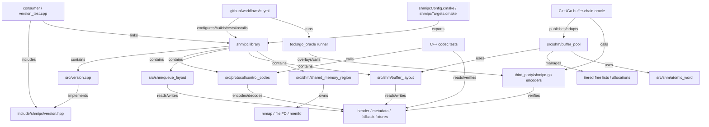
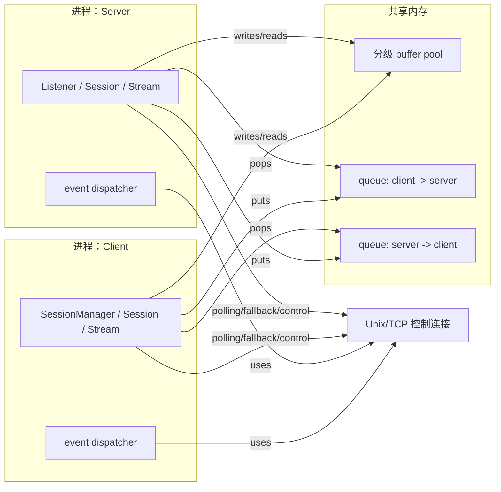
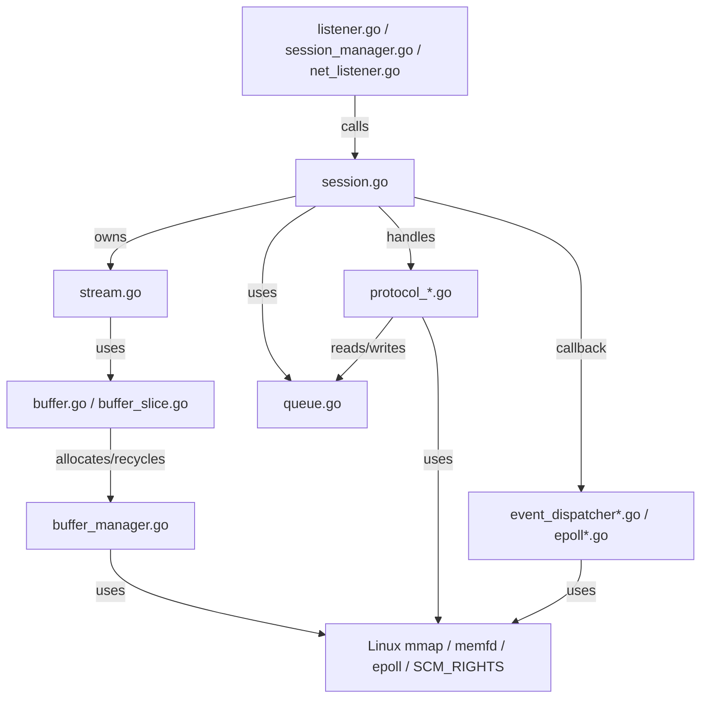
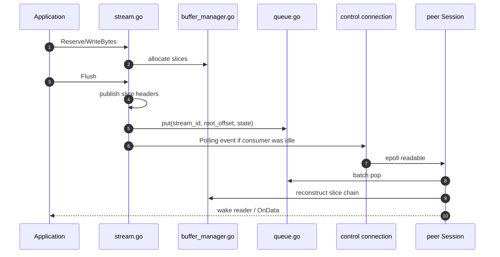
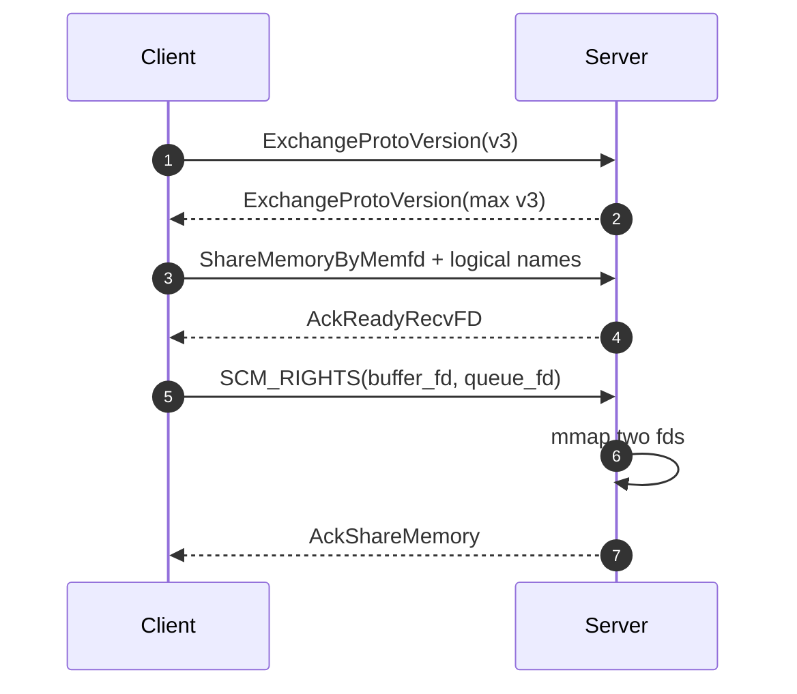

# 架构关系图

## 当前 C++ 依赖与协议验证

```mermaid
graph TD
  consumer["consumer / version_test.cpp"]
  public["include/shmipc/version.hpp"]
  library["shmipc library"]
  implementation["src/version.cpp"]
  package["shmipcConfig.cmake / shmipcTargets.cmake"]
  ci[".github/workflows/ci.yml"]
  runner["tools/go_oracle runner"]
  upstream["third_party/shmipc-go encoders"]
  golden["header / metadata / fallback fixtures"]
  codec["src/protocol/control_codec"]
  queue_layout["src/shm/queue_layout"]
  buffer_layout["src/shm/buffer_layout"]
  mapping["src/shm/shared_memory_region"]
  pool["src/shm/buffer_pool"]
  atomic["src/shm/atomic_word"]
  interop["C++/Go buffer-chain oracle"]
  golden_test["C++ codec tests"]

  consumer -- includes --> public
  consumer -- links --> library
  implementation -- implements --> public
  library -- contains --> implementation
  package -- exports --> library
  ci -- configures/builds/tests/installs --> library
  runner -- overlays/calls --> upstream
  upstream -- verifies --> golden
  codec -- encodes/decodes --> golden
  golden_test -- calls --> codec
  golden_test -- reads/verifies --> golden
  library -- contains --> codec
  library -- contains --> queue_layout
  queue_layout -- reads/writes --> golden
  library -- contains --> buffer_layout
  buffer_layout -- reads/writes --> golden
  library -- contains --> mapping
  mapping -- owns --> os_mapping["mmap / file FD / memfd"]
  pool -- uses --> buffer_layout
  pool -- manages --> pool_bytes["tiered free lists / allocations"]
  pool -- uses --> atomic
  interop -- publishes/adopts --> pool
  interop -- calls --> upstream
  ci -- runs --> runner
```

## 运行时边界

```mermaid
graph LR
  subgraph client["进程：Client"]
    c_api["SessionManager / Session / Stream"]
    c_epoll["event dispatcher"]
  end
  subgraph shared["共享内存"]
    buf["分级 buffer pool"]
    q1["queue: client -> server"]
    q2["queue: server -> client"]
  end
  subgraph server["进程：Server"]
    s_epoll["event dispatcher"]
    s_api["Listener / Session / Stream"]
  end
  ctrl["Unix/TCP 控制连接"]

  c_api -- writes/reads --> buf
  s_api -- writes/reads --> buf
  c_api -- puts --> q1
  s_api -- pops --> q1
  s_api -- puts --> q2
  c_api -- pops --> q2
  c_epoll -- uses --> ctrl
  s_epoll -- uses --> ctrl
  c_api -- polling/fallback/control --> ctrl
  s_api -- polling/fallback/control --> ctrl
```
## 模块依赖图

```mermaid
graph TD
  api["listener.go / session_manager.go / net_listener.go"]
  session["session.go"]
  stream["stream.go"]
  buffer["buffer.go / buffer_slice.go"]
  manager["buffer_manager.go"]
  queue["queue.go"]
  protocol["protocol_*.go"]
  event["event_dispatcher*.go / epoll*.go"]
  os["Linux mmap / memfd / epoll / SCM_RIGHTS"]

  api -- calls --> session
  session -- owns --> stream
  stream -- uses --> buffer
  buffer -- allocates/recycles --> manager
  session -- uses --> queue
  session -- handles --> protocol
  protocol -- reads/writes --> queue
  session -- callback --> event
  event -- uses --> os
  manager -- uses --> os
  protocol -- uses --> os
```

## 共享内存发送链路

```mermaid
sequenceDiagram
  autonumber
  participant App as Application
  participant Stream as stream.go
  participant BM as buffer_manager.go
  participant Q as queue.go
  participant Ctrl as control connection
  participant Peer as peer Session

  App->>Stream: Reserve/WriteBytes
  Stream->>BM: allocate slices
  App->>Stream: Flush
  Stream->>Stream: publish slice headers
  Stream->>Q: put(stream_id, root_offset, state)
  Stream->>Ctrl: Polling event if consumer was idle
  Ctrl->>Peer: epoll readable
  Peer->>Q: batch pop
  Peer->>BM: reconstruct slice chain
  Peer-->>App: wake reader / OnData
```

## v3 memfd 握手

```mermaid
sequenceDiagram
  autonumber
  participant C as Client
  participant S as Server
  C->>S: ExchangeProtoVersion(v3)
  S-->>C: ExchangeProtoVersion(max v3)
  C->>S: ShareMemoryByMemfd + logical names
  S-->>C: AckReadyRecvFD
  C->>S: SCM_RIGHTS(buffer_fd, queue_fd)
  S->>S: mmap two fds
  S-->>C: AckShareMemory
```
